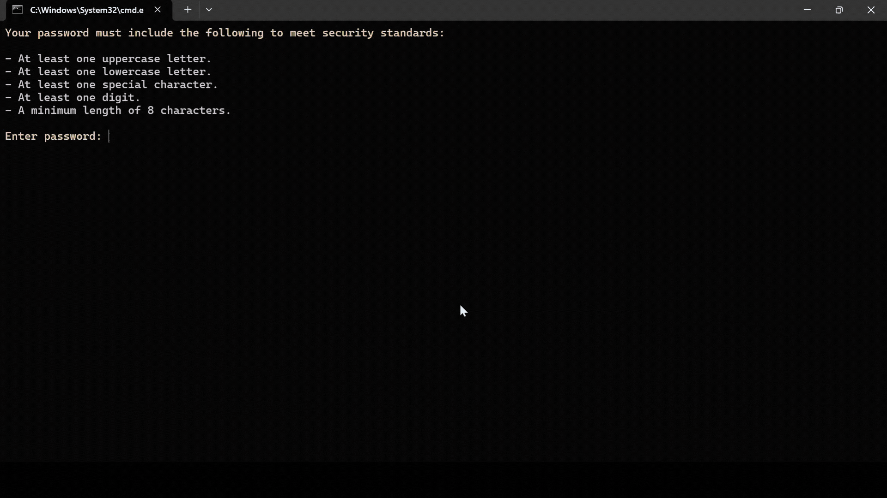

# Password Strength Checker

This Python script assesses the strength of a given password based on specific criteria such as length, presence of uppercase and lowercase letters, digits, and special characters.

## Demo



## Description

The Password Strength Checker evaluates the strength of passwords to help users create more secure passwords for their accounts. It provides feedback on whether the password is weak, moderate, or strong based on various factors.

## Features

- Checks if the password contains at least one uppercase letter, one lowercase letter, one special character, and one digit.
- Ensures the password meets a minimum length requirement of 8 characters.
- Provides color-coded feedback on the strength of the password.
- Allows users to retry entering a password if it does not meet the requirements.

## Requirements

- Python 3.x
- Operating System with terminal support

## Installation

1. Clone the repository or download the Python script.
2. Ensure you have Python installed on your system.
3. Run the script using a Python interpreter.

```bash
py password_strength_checker.py
